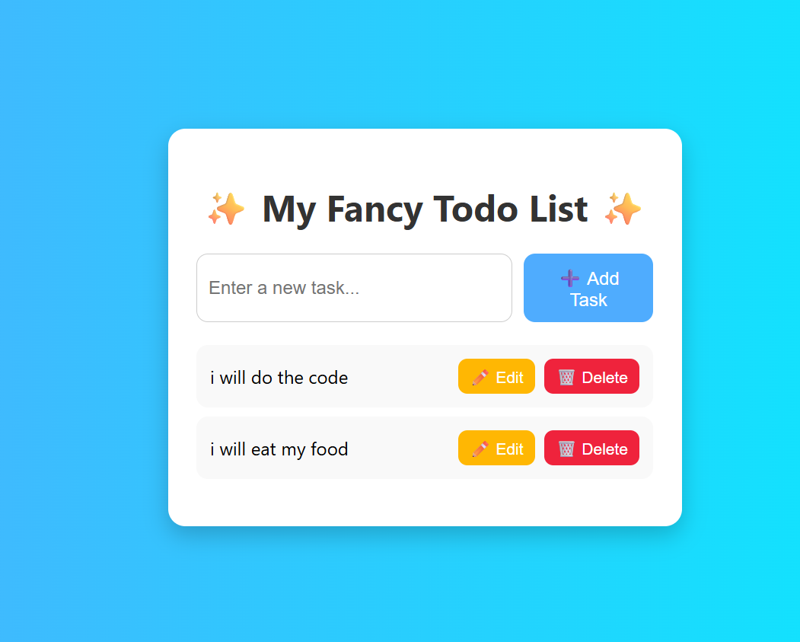

# Fancy TypeScript Todo List

A simple, stylish Todo List web app built with TypeScript, HTML, and CSS.

## Features

- Add, edit, and delete tasks
- Modern UI with gradient background and card layout
- Responsive and easy to use
- Written in TypeScript for type safety

## Project Structure

```
index.html
README.md
stayel.css
todo.js
todo.ts
screenshot.png
```

- `index.html`: Main HTML file for the app
- `stayel.css`: Custom styles for layout and design
- `todo.ts`: TypeScript source for Todo logic
- `todo.js`: Compiled JavaScript (from `todo.ts`)
- `screenshot.png`: Example screenshot of the app

## Getting Started

1. **Clone or download the project.**
2. Open `index.html` in your browser to use the Todo List.
3. To modify logic, edit `todo.ts` and recompile with TypeScript:
   ```powershell
   tsc todo.ts
   ```
4. Customize styles in `stayel.css` as desired.

## Usage

- Type a task and click "Add Task".
- Edit or delete tasks using the provided buttons.

## Example Screenshot



## Dependencies

- No external dependencies required. All logic and styles are included in the project files.

## License

This project is open source and free to use.
